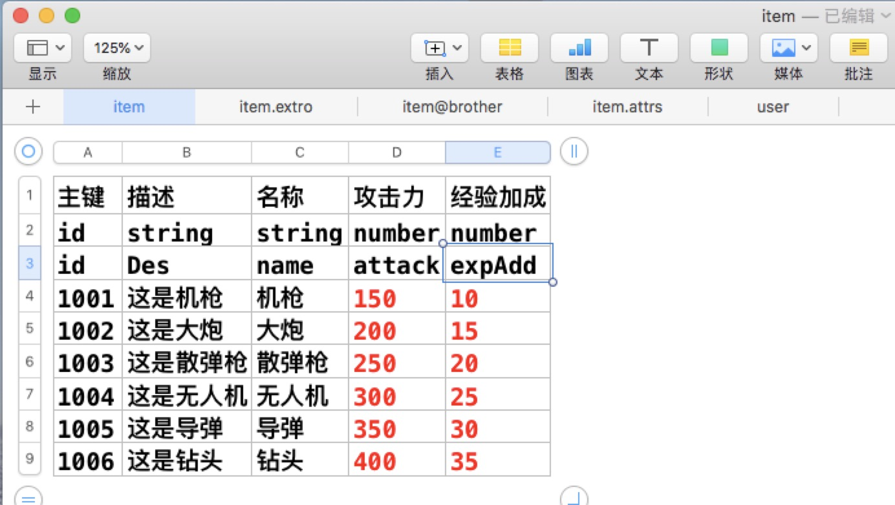

### xlsxParser ([English Document](./docs/english.md))
> 让复杂的excel转化为你想要的json。


### 使用说明
* 目前只支持.xlsx格式。
* 本项目是基于nodejs的，请先安装nodejs环境。
* 执行命令
```bash
# Clone this repository
git clone https://github.com/sliencio/xlsxParser.git
# Go into the repository
cd xlsxParser
# Install dependencies
npm install
```

* 配置config.json
```javascript
{
  "xlsx": {
    //类型所在行
    "typeRow":2,
    //标题所在行
    "headRow": 3,
    //xlsx路径
    "src": "./excel/**/[^~$]*.xlsx",
    //输出路径
    "outPath": "./json",
    //array 分割符
    "arrayFlag":",",
    //子表的连接符号
    "sonCon": ".",
    //兄弟表连接符号
    "brotherCon": "&"
  },
  "json": {
    //是否压缩json
    "compress": false
  }
}
```
### 运行

#### linux 或者 unix

``` shell
  bash export.sh
```

#### window

​	双击 export.bat 即可

### 导出文件

​	读取 `./excel/` 路径下的所有xlsx 文件，导出到路径 `./json/` 下，json文件名以sheet名命名

#### 示例1 基本功能(参考./excel/basic.xlsx)   


输出如下(子表：item.extro :)：(兄弟表：item&brother) {数组子表 item.attrs}

```json
{
  "1001": {
    "id": "1001",
    "Des": "这是机枪",
    "name": "机枪",
    "attack": 150,
    "expAdd": 10,
    "extro": {
      "id": "1001",
      "extro": "机枪的额外属性"
    },
    "attrs": [
      {
        "id": "1001",
        "value": 10,
        "name": "名称1"
      },
      {
        "id": "1001",
        "value": 15,
        "name": "名称2"
      },
      {
        "id": "1001",
        "value": 20,
        "name": "名称3"
      },
      {
        "id": "1001",
        "value": 25,
        "name": "名称4"
      },
      {
        "id": "1001",
        "value": 30,
        "name": "名称5"
      },
      {
        "id": "1001",
        "value": 35,
        "name": "名称6"
      }
    ],
    "life": 200
  }
}
```


### 支持以下数据类型

* `number` 数字类型。
* `boolean`  布尔。
* `string` 字符串。
* `date` 日期类型。
* `object `对象，同JS对象一致。
* `array`  数组，同JS数组一致。
* `id` 主键类型(当表中有id类型时，json会以hash格式输出，否则以array格式输出)。
* `id[]` 主键数组，只存在于从表中。


### 表头规则

* 基本数据类型(string,number,bool)时候，一般不需要设置会自动判断，但是也可以明确声明数据类型。
* 字符串类型：命名形式 `列名string` 。
* 数字类型：命名形式 `列名number` 。
* 日期类型：`列名date` 。日期格式要符合标准日期格式。比如`YYYY/M/D H:m:s` or `YYYY/M/D` 等等。
* 布尔类型：命名形式 `列名bool` 。
* 数组：命名形式  `列名[]`。
* 对象：命名形式 `列名{}`。
* 主键：命名形式`列名id` ,表中只能有一列。
* 主键数组：命名形式`列名id[]`，表中只能有一列，只存在于从表中。
* 列名字以`!`开头则不导出此列。


### sheet规则

- sheet名字以`！`开头则不导出此表。
- 从表的名字 `主表名字` . `子表`   `主表名字` & `兄弟表`，主表必须在子表或者兄弟表的前面。

### 注意事项

* 关键符号都是英文半角符号，和JSON要求一致。
* 对象写法同JavaScript中对象写法一致
* 数组写法同JavaScript中数组写法一致

### 补充

* 可在windows/mac/linux下运行。
* 项目地址 [xlsxParser](https://github.com/sliencio/xlsxParser)
